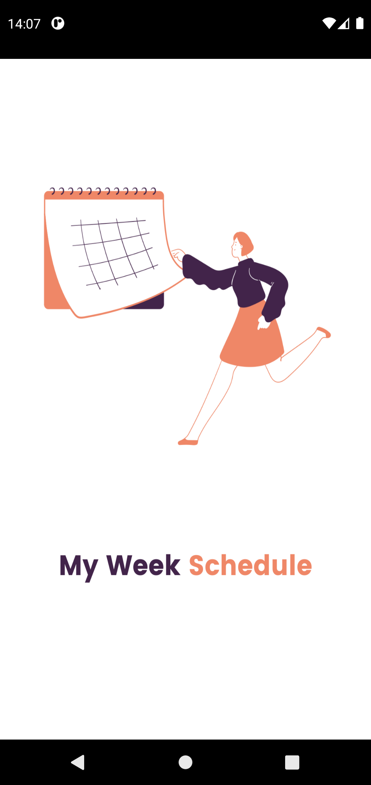
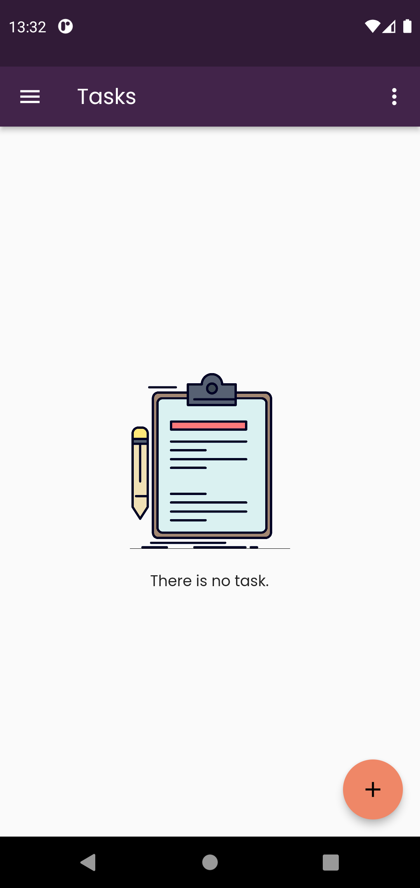
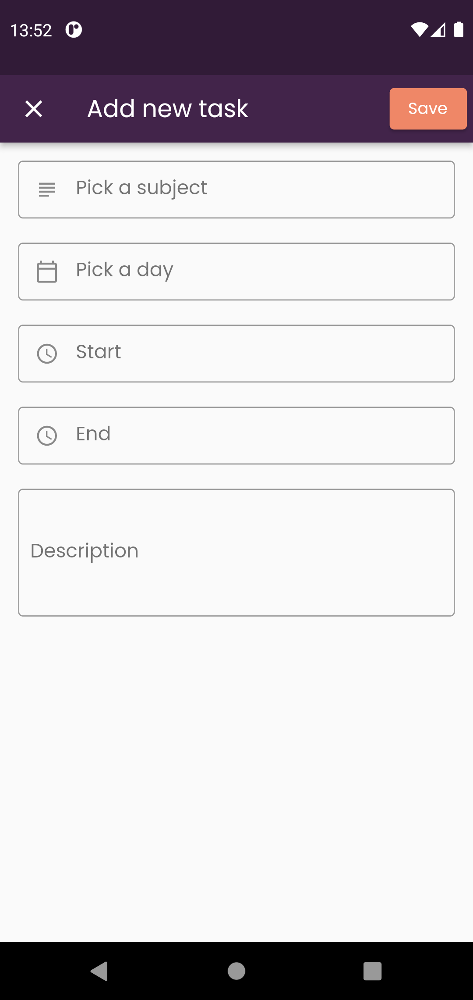
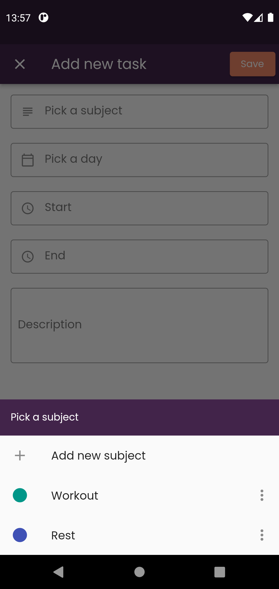
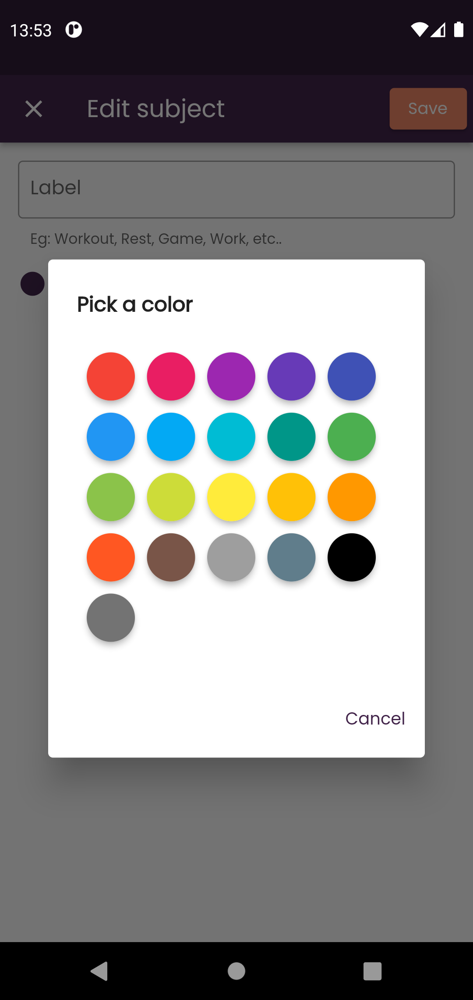
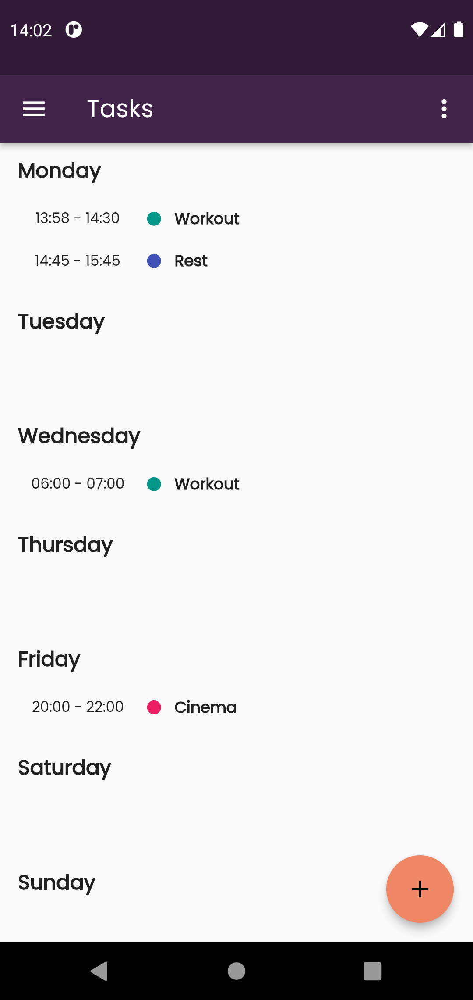
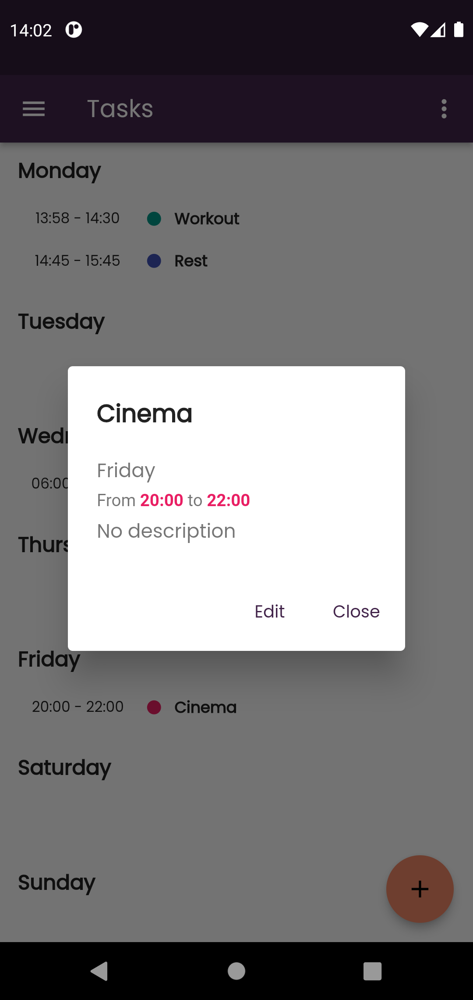
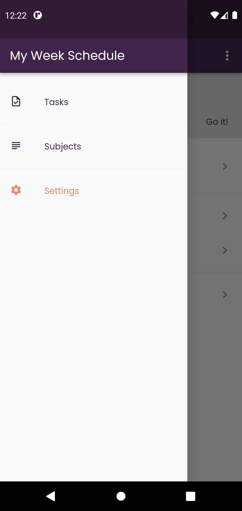
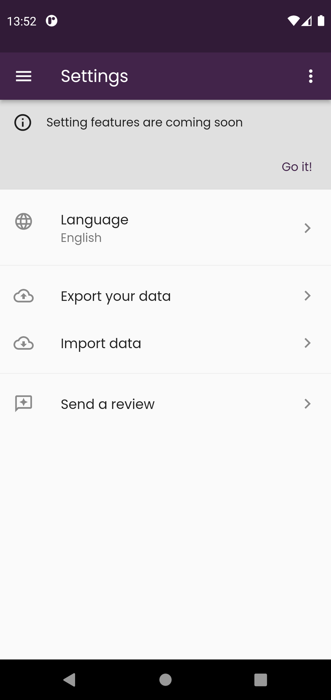

# My week schedule

A simple mobile application to plan your week.

## Screenshots 📸

| Splash screen | Tasks list (empty state) | Add new task |
|----------------|-------------------------------|-----------------------------|
|||            |

| Select a subject | Update subject color | Tasks list (with data) |
|----------------|-------------------------------|-----------------------------|
|||            |

| Task details | Menu | Settings |
|----------------|-------------------------------|-----------------------------|
|||            |

## Do you want to install it ?

Just download the realease apk in the right section. Thanks!!

## TODO

- Finish settings screen
- Add push notifications
- Add more languages